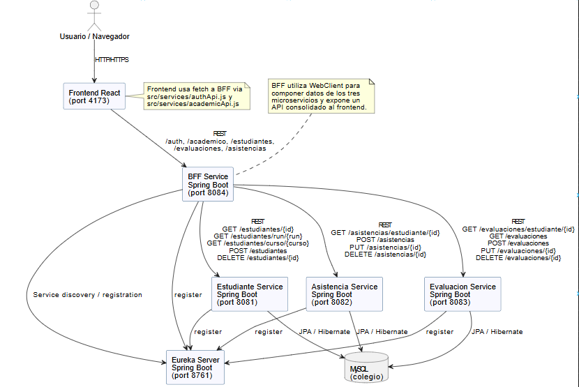

# Entrega 2 - Full Stack III

Este proyecto implementa una plataforma académica basada en microservicios para la gestión de estudiantes, asistencias y evaluaciones, incluyendo un Backend For Frontend (BFF).

## Estructura del proyecto
- **estudiante-service**: Microservicio para la gestión de estudiantes.
- **asistencia-service**: Microservicio para el registro de asistencias.
- **evaluacion-service**: Microservicio para la gestión de evaluaciones.
- **bff-service**: Backend For Frontend que orquesta y compone datos de los microservicios.
- **eureka-server**: Servidor Eureka para el descubrimiento de servicios.
- **frontend**: Aplicación React para consumir el BFF y mostrar los datos académicos.

## Tecnologías principales
- Java 17
- Spring Boot
- Spring Data JPA
- H2 Database
- Eureka Server y Eureka Client
- Swagger (springdoc-openapi)
- Maven

## Instalación y ejecución
1. Instala dependencias en cada servicio:
   ```
   ./mvnw clean install
   ```
2. Inicia primero el servidor Eureka:
   ```
   cd eureka-server
   ./mvnw spring-boot:run
   ```
3. Inicia cada microservicio y el BFF en terminales separadas:
   ```
   cd estudiante-service
   ./mvnw spring-boot:run
   
   cd asistencia-service
   ./mvnw spring-boot:run
   
   cd evaluacion-service
   ./mvnw spring-boot:run
   
   cd bff-service
   ./mvnw spring-boot:run
   ```
4. En otra terminal, instala y ejecuta el frontend React:
   ```
   cd frontend
   npm install
   npm run dev
   ```

## Arquitectura del Sistema



*Diagrama que muestra la comunicación entre componentes: Frontend React, BFF Service, microservicios (estudiante, asistencia, evaluación), Eureka Server y MySQL.*

## Documentación

### Documentación del Proyecto
Consulta la carpeta [`documentation/`](./documentation/) para encontrar:
- **Diagrama de Arquitectura**: Diagrama visual de todos los componentes y sus interacciones
- **Descripción de Persistencia**: Detalles sobre la implementación de bases de datos con JPA
- **Informe de Pruebas Unitarias**: Métricas y cobertura de tests
- **Especificación de API REST**: Documentación de endpoints

### Documentación Swagger (en vivo)
Accede a la documentación de cada servicio en:
- Estudiantes: http://localhost:8081/swagger-ui.html
- Asistencias: http://localhost:8082/swagger-ui.html
- Evaluaciones: http://localhost:8083/swagger-ui.html
- BFF: http://localhost:8084/swagger-ui.html
- Eureka: http://localhost:8761

### Con Docker Compose
```bash
docker-compose up
```
Todos los servicios estarán disponibles en los puertos indicados arriba.

## Instrucciones de Entrega
Consulta el archivo [`repositorios.txt`](./repositorios.txt) para encontrar:
- Enlaces a todos los repositorios
- Credenciales de prueba
- Instrucciones completas de ejecución

## Notas
- Todos los servicios fueron generados usando el arquetipo estándar de Spring Boot (Spring Initializr).
- Consulta los README.md de cada servicio para más detalles.
- Para ejecutar con Docker Compose, asegúrate de tener Docker instalado: `docker-compose up`
