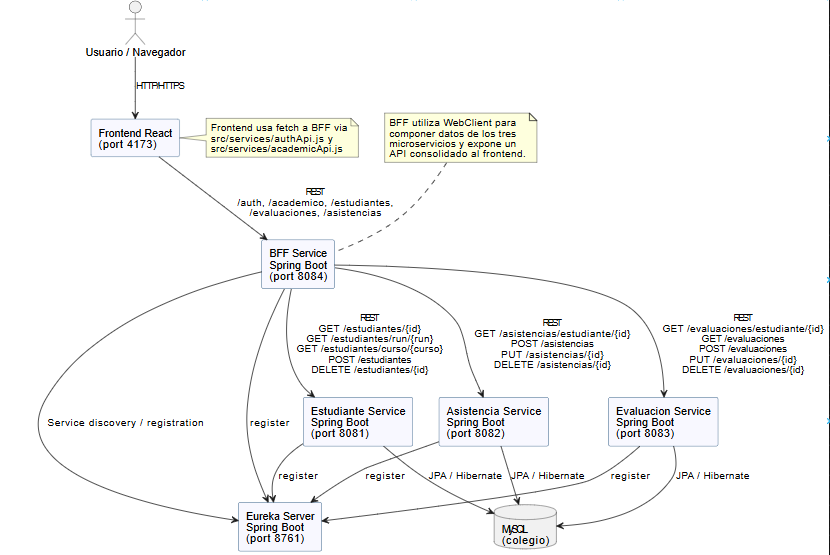

# Proyecto Colegio Bernardo O'Higgins

## Ejecutar tests (BFF)

Desde la carpeta `bff-service` puedes ejecutar los tests con Maven Wrapper:

```powershell
cd bff-service
.\mvnw test
```

Para ejecutar sólo los tests principales de integración/E2E:

```powershell
.\mvnw test "-Dtest=AcademicoIntegrationTest,AcademicoE2ETest,BffServiceApplicationTests"
```

## Documentación y entregables

La carpeta `documentation/` contiene los documentos de entrega requeridos:

- `Descripcion_Persistencia.pdf`
- `Informe_Pruebas_Unitarias.pdf`
- `API_REST_Especificacion.pdf`
- `video_checklist.md`
- `repositorios.txt`

Conviene incluir los `.pdf` en la entrega y verificar que estén actualizados.

# Proyecto Colegio Bernardo O'Higgins

Plataforma académica Angular y Spring Boot para gestionar estudiantes, asistencia y evaluaciones mediante microservicios y un BFF protegido con Microsoft Entra ID.

## Estructura del proyecto
- **estudiante-service**: Microservicio para la gestión de estudiantes.
- **asistencia-service**: Microservicio para el registro de asistencias.
- **bff-service**: Backend For Frontend que orquesta y compone datos de los microservicios.
- **eureka-server**: Servidor Eureka para el descubrimiento de servicios.
- **frontend-angular**: Aplicación Angular con MSAL para autenticación y consumo del BFF.

**Flujo de comunicación:**
- El usuario accede a través del frontend Angular.
- Las solicitudes van al **BFF Service** (puerto 8084) vía API Gateway.
- El BFF compone datos de los tres microservicios mediante WebClient
- Cada microservicio consulta su propia BD (MySQL o H2)
- Todos los servicios se registran con **Eureka Server** (puerto 8761) para descubrimiento dinámico

## Tecnologías principales
- Angular 18 y MSAL
- Java 17/21
- Spring Boot
- Spring Data JPA
- H2 Database
- Eureka Server y Eureka Client
- Swagger (springdoc-openapi)
- Maven

## Instalación y ejecución
1. Instala dependencias en cada servicio:
   ```
   ./mvnw clean install
   ```
2. Inicia primero el servidor Eureka:
   ```
   cd eureka-server
   ./mvnw spring-boot:run
   ```
3. Inicia cada microservicio y el BFF en terminales separadas:
   ```
   cd estudiante-service
   ./mvnw spring-boot:run
   
   cd asistencia-service
   ./mvnw spring-boot:run
   
   cd bff-service
   ./mvnw spring-boot:run
   ```
4. En otra terminal, instala y ejecuta el frontend Angular:
   ```
   cd frontend-angular
   npm install
   npm start
   ```

## Autenticación y seguridad

- Angular usa Microsoft Entra ID mediante `@azure/msal-angular`.
- El interceptor MSAL adjunta el access token al consumir el BFF.
- API Gateway valida issuer, audience y scope `api.access`.
- El BFF valida nuevamente el JWT con Spring Security Resource Server.
- Sin token se espera `401`; sin scope suficiente, `403`.

## Despliegue AWS

La infraestructura está en `infrastructure/aws-terraform/` y reutiliza la VPC, RDS, ALB y Security Groups existentes de AWS Academy.

### Flujo de eventos RabbitMQ

Los POST de estudiantes, asistencias y evaluaciones persisten primero el registro y luego publican un evento JSON al exchange topic `eventos.exchange`. Las routing keys son `evento.estudiante.creado`, `evento.asistencia.registrada` y `evento.evaluacion.calificada`, enrutadas respectivamente a `eventos.estudiante`, `eventos.asistencia` y `eventos.evaluacion`. `rabbit-admin` consume las tres colas y confirma los mensajes válidos con ACK. Los mensajes rechazados van al exchange direct `eventos.dlx` y a su DLQ de dominio; las DLQ durables no tienen consumidores automáticos y retienen los mensajes hasta su revisión/eliminación manual. La actualización de estudiante reutiliza actualmente el flujo de guardado y también publica `estudiante.creado`.

RabbitMQ se ejecuta como contenedor en la EC2, persiste sus datos en el volumen Docker `rabbitmq_data` al recrear el contenedor en la misma instancia y no publica AMQP hacia la red del host. Ese volumen local no sobrevive a la terminación o reemplazo de la EC2; para ese escenario se requiere almacenamiento EBS persistente y respaldos. En AWS, el panel de administración escucha en el host por el puerto `15672`; Terraform solo permite ese puerto desde el CIDR de `admin_cidr`. Usa una IP pública autorizada con máscara `/32` y accede directamente desde el navegador:

`http://<dns-publico-ec2>:15672`

No abras el puerto a `0.0.0.0/0`. `admin_cidr` también limita SSH; si tu IP cambia, actualiza esa variable antes de aplicar Terraform. Define una contraseña de RabbitMQ de entre 6 y 128 caracteres usando solo letras, números, `-` o `_`. Para la práctica puedes usar `123456`, aunque es una contraseña débil y no se recomienda fuera de un entorno académico aislado. Terraform la recibe mediante `TF_VAR_rabbitmq_password`; también puedes definir `rabbitmq_username` en `terraform.tfvars` si cambias el usuario por defecto `colegio_app`. El valor queda en el estado de Terraform y en la configuración de arranque de EC2, por lo que protege también ese estado y restringe el acceso administrativo a la instancia.

Las colas `eventos.*.dlq` son durables y no tienen consumidores automáticos: los mensajes rechazados permanecen en ellas hasta que se revisen y eliminen manualmente. Los consumidores de las colas principales registran el error antes de enviar el mensaje a la DLQ. Para inspeccionar un mensaje desde RabbitMQ Management, abre la cola DLQ y usa **Get messages** con requeue habilitado para no retirarlo de forma permanente. Después de revisarlo, confirma/elimina el mensaje desde el panel. Esta política no aplica expiración automática; monitorea el crecimiento de las DLQ y límpialas periódicamente.

Para crear EC2 con acceso SSH, define `ec2_key_name` en `terraform.tfvars` con el nombre de un key pair existente en la región configurada. Si no lo necesitas, déjalo vacío; la instancia se creará sin key pair.

El workflow de GitHub Actions publica imágenes Docker, incluido `rabbit-admin`, en GHCR. Para usarlas en EC2, configura `image_prefix` con el prefijo `ghcr.io/<owner>/<repo-en-minusculas>-` y `image_tag` con el tag publicado, y asegúrate de que la instancia pueda descargar esos paquetes. Si no se configura el prefijo o falla la descarga, el script intenta construir las imágenes localmente.

Cuando la descarga de imágenes no está configurada o falla, el bootstrap construye y arranca primero el frontend y después compila los servicios backend. La página puede mostrarse antes de que la API esté lista; las operaciones que requieren el backend funcionarán cuando esos servicios terminen de arrancar.

```text
CloudFront HTTPS
   ↓
EC2 con Nginx y Docker Compose
   ↓
API Gateway + JWT Entra ID
   ↓
VPC Link → ALB interno → BFF
   ↓
Microservicios → RDS MySQL
```

Desde `infrastructure/aws-terraform/`:

```bash
terraform init
terraform validate
terraform plan
terraform apply
```

Después del despliegue, usar:

```bash
terraform output url_frontend
terraform output endpoint_api_gateway
```

El frontend debe abrirse con la URL `https://` de CloudFront. Esa URL debe registrarse en Microsoft Entra como Redirect URI de tipo SPA. La URL HTTP directa de EC2 queda solo para diagnóstico, porque MSAL requiere un contexto seguro.

## Arquitectura del Sistema



*Diagrama que muestra la comunicación entre componentes: Frontend React, BFF Service, microservicios (estudiante, asistencia, evaluación), Eureka Server y MySQL.*

## Documentación

### Documentación del Proyecto
Consulta la carpeta [`documentation/`](./documentation/) para encontrar:
- **Diagrama de Arquitectura**: Diagrama visual de todos los componentes y sus interacciones
- **Descripción de Persistencia**: Detalles sobre la implementación de bases de datos con JPA
- **Informe de Pruebas Unitarias**: Métricas y cobertura de tests
- **Especificación de API REST**: Documentación de endpoints

### Documentación Swagger (en vivo)
Accede a la documentación de cada servicio en:
- Estudiantes: http://localhost:8081/swagger-ui.html
- Asistencias: http://localhost:8082/swagger-ui.html
- BFF: http://localhost:8084/swagger-ui.html
- Eureka: http://localhost:8761

### Con Docker Compose
```bash
docker-compose up
```
Antes, copia `.env.example` a `.env` y reemplaza `RABBITMQ_PASSWORD` por un secreto local aleatorio. En desarrollo local, el panel RabbitMQ se publica solo en `localhost:15672`; AMQP permanece disponible únicamente dentro de la red Docker.

## Instrucciones de Entrega
Consulta el archivo [`repositorios.txt`](./repositorios.txt) para encontrar:
- Enlaces a todos los repositorios
- Credenciales de prueba
- Instrucciones completas de ejecución

## Notas
- Todos los servicios fueron generados usando el arquetipo estándar de Spring Boot (Spring Initializr).
- Consulta los README.md de cada servicio para más detalles.
- Para ejecutar con Docker Compose, asegúrate de tener Docker instalado: `docker-compose up`
